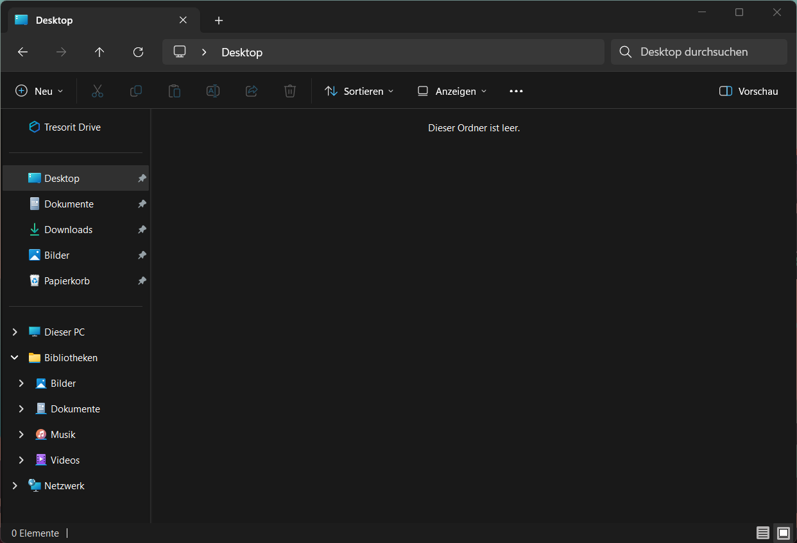
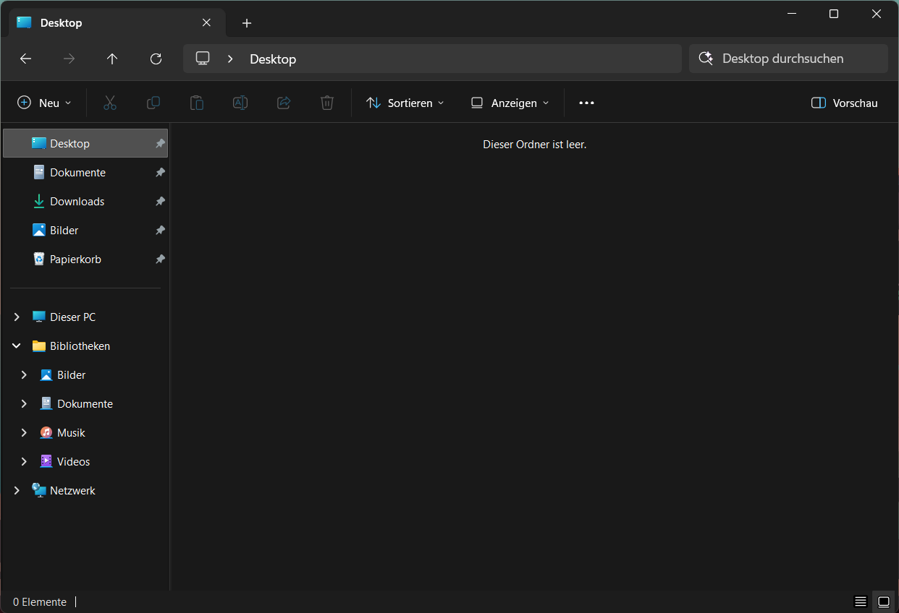

## Remove Tresorit Drive from the Windows 11 Explorer Navigation pane

Tresorit Drive appears in the Explorer Navigation Pane and *cannot* be removed through Windows settings. 
This script removes it by disabling the namespace tree entry in the registry.

## What it does

The script sets `System.IsPinnedToNamespaceTree` to `0` for Tresorit's CLSID in `HKCU\Software\Classes\CLSID`.
Result: Tresorit Drive vanishes from your sidebar.



*Before: Tresorit Drive stuck in Navigation Pane*



*After: Tresorit Drive removed*

**Important:** Tresorit re-registers itself every time it starts. If Tresorit restarts (process killed, app restarted, etc.), run the script again.

## Usage

**One-time:**
```
remove-tresorit.bat
```

No restart needed. Explorer updates immediately.

**Automate:**
- Create a shortcut to `remove-tresorit.bat`
- Move it to `%AppData%\Microsoft\Windows\Start Menu\Programs\Startup`
- Script runs automatically after each boot

(If Tresorit restarts mid-session, just re-run manually or set up Task Scheduler for more granular control.)

## What you need

- Windows 11
- Administrator privileges

## How it works

```batch
@echo off
reg add "HKCU\Software\Classes\CLSID\{1B8DEAA1-E192-429B-89A7-89BD19183A67}" /v "System.IsPinnedToNamespaceTree" /t REG_DWORD /d 0 /f
```

The CLSID `{1B8DEAA1-E192-429B-89A7-89BD19183A67}` is Tresorit Drive's identifier in Windows.

## Undo

To restore Tresorit Drive:

```batch
reg add "HKCU\Software\Classes\CLSID\{1B8DEAA1-E192-429B-89A7-89BD19183A67}" /v "System.IsPinnedToNamespaceTree" /t REG_DWORD /d 1 /f
```

Or restart Tresorit or Windows.

## License

MIT
```
